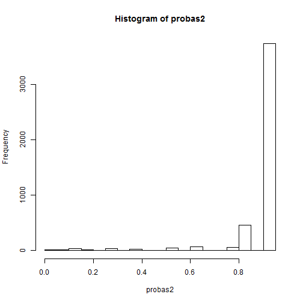

Analysis of diagnostic programm performances
========================================================

# Performance Analysis

## Summary

```r
require(pROC)
```

```
## Loading required package: pROC
```

```
## Warning: package 'pROC' was built under R version 3.0.3
```

```
## Type 'citation("pROC")' for a citation.
## 
## Attaching package: 'pROC'
## 
## L'objet suivant est masqué from 'package:stats':
## 
##     cov, smooth, var
```

```r
require(ROCR)
```

```
## Loading required package: ROCR
```

```
## Warning: package 'ROCR' was built under R version 3.0.3
```

```
## Loading required package: gplots
```

```
## Warning: package 'gplots' was built under R version 3.0.3
```

```
## KernSmooth 2.23 loaded
## Copyright M. P. Wand 1997-2009
## 
## Attaching package: 'gplots'
## 
## L'objet suivant est masqué from 'package:stats':
## 
##     lowess
```

```r
require(epicalc)
```

```
## Loading required package: epicalc
```

```
## Warning: package 'epicalc' was built under R version 3.0.3
```

```
## Loading required package: foreign
## Loading required package: survival
```

```
## Warning: package 'survival' was built under R version 3.0.3
```

```
## Loading required package: MASS
## Loading required package: nnet
## 
## Attaching package: 'epicalc'
## 
## L'objet suivant est masqué from 'package:pROC':
## 
##     auc, ci, ci.default
```

```r
library("party")
```

```
## Warning: package 'party' was built under R version 3.0.3
```

```
## Loading required package: grid
## Loading required package: mvtnorm
```

```
## Warning: package 'mvtnorm' was built under R version 3.0.3
```

```
## Loading required package: modeltools
## Loading required package: stats4
## Loading required package: strucchange
```

```
## Warning: package 'strucchange' was built under R version 3.0.3
```

```
## Loading required package: zoo
```

```
## Warning: package 'zoo' was built under R version 3.0.3
```

```
## 
## Attaching package: 'zoo'
## 
## L'objet suivant est masqué from 'package:base':
## 
##     as.Date, as.Date.numeric
## 
## Loading required package: sandwich
```

```
## Warning: package 'sandwich' was built under R version 3.0.3
```

```r
datas = read.csv2("../test/temp.csv", sep = ";", colClasses = c("NULL", "NULL", 
    "factor", "NULL", "NULL", "factor", "factor", "numeric", "factor", "factor", 
    "numeric", "numeric", "numeric", "numeric"))
# protocol Success formula_human formula_cpu Ininterp_human Ininterp_cpu
# AnomaliesCount problem problemSerie
head(datas)
```

```
##   Success Ininterp_human Ininterp_cpu AnomaliesCount problem problemSerie
## 1       1              1            1              0  Tt1_v2           v2
## 2       0              1            1              2  Tp2_v2           v2
## 3       1              1            1              0  Tt3_v2           v2
## 4       1              1            1              0  Ct1_v2           v2
## 5       1              1            1              0  Ct3_v2           v2
## 6       1              1            1              1  Tp1_v2           v2
##   DoubtInterp DoubtSelect DoubtNumber DoubtUncat
## 1           0           0           0          0
## 2           0           1           1          0
## 3           0           0           0          0
## 4           0           0           0          0
## 5           0           0           0          0
## 6           0           1           0          0
```

```r
summary(datas)
```

```
##  Success  Ininterp_human Ininterp_cpu AnomaliesCount     problem    
##  0: 532   0:  99         0: 214       Min.   : 0.00   Cp3_v2 : 193  
##  1:4000   1:4433         1:4318       1st Qu.: 0.00   Ct1_v2 : 193  
##                                       Median : 0.00   Ct2_v2 : 193  
##                                       Mean   : 0.28   Tp1_v2 : 191  
##                                       3rd Qu.: 0.00   Tt1_v2 : 191  
##                                       Max.   :42.00   Ct3_v2 : 190  
##                                                       (Other):3381  
##  problemSerie  DoubtInterp     DoubtSelect     DoubtNumber      DoubtUncat
##  v1:1501      Min.   :0.000   Min.   :0.000   Min.   : 0.00   Min.   :0   
##  v2:3031      1st Qu.:0.000   1st Qu.:0.000   1st Qu.: 0.00   1st Qu.:0   
##               Median :0.000   Median :0.000   Median : 0.00   Median :0   
##               Mean   :0.026   Mean   :0.066   Mean   : 0.18   Mean   :0   
##               3rd Qu.:0.000   3rd Qu.:0.000   3rd Qu.: 0.00   3rd Qu.:0   
##               Max.   :7.000   Max.   :5.000   Max.   :35.00   Max.   :0   
## 
```


## some tables

```r
table(datas$Success)
```

```
## 
##    0    1 
##  532 4000
```

```r
datas2 <- datas
datas2$AnomaliesCount[datas2$AnomaliesCount >= 4] <- ">3"
datas2$AnomaliesCount <- as.factor(datas2$AnomaliesCount)
datas2$AnomaliesCount = factor(datas2$AnomaliesCount, levels(datas2$AnomaliesCount)[c(2:4, 
    1)])
table(datas2$AnomaliesCount, datas2$Ininterp_cpu)
```

```
##     
##         0    1
##   0    60 3734
##   1    50  459
##   2    39   71
##   >3   24   25
```

```r
t2 = table(datas2$Ininterp_cpu, datas2$Success, dnn = c("ininterpretable", "succès"))
t3 = table(datas2$AnomaliesCount, datas2$Success, dnn = c("Valeurs du compteur", 
    "succès"))
t3
```

```
##                    succès
## Valeurs du compteur    0    1
##                  0   257 3537
##                  1   126  383
##                  2    64   46
##                  >3   35   14
```

```r
prop.table(t3, 1)
```

```
##                    succès
## Valeurs du compteur       0       1
##                  0  0.06774 0.93226
##                  1  0.24754 0.75246
##                  2  0.58182 0.41818
##                  >3 0.71429 0.28571
```

```r
prop.table(t3)
```

```
##                    succès
## Valeurs du compteur        0        1
##                  0  0.057597 0.792694
##                  1  0.028238 0.085836
##                  2  0.014343 0.010309
##                  >3 0.007844 0.003138
```

```r
prop.table(t2, 1)
```

```
##                succès
## ininterpretable       0       1
##               0 0.57009 0.42991
##               1 0.09495 0.90505
```

```r
prop.table(t2, 2)
```

```
##                succès
## ininterpretable      0      1
##               0 0.2293 0.0230
##               1 0.7707 0.9770
```

```r
prop.table(t2)
```

```
##                succès
## ininterpretable       0       1
##               0 0.02692 0.02030
##               1 0.09047 0.86231
```

```r
nrow(datas)
```

```
## [1] 4532
```

```r
table(datas2$Success, datas2$problemSerie)
```

```
##    
##       v1   v2
##   0  240  292
##   1 1261 2739
```

```r
datas3 <- datas
t = table(datas$Success)
t/margin.table(t)
```

```
## 
##      0      1 
## 0.1174 0.8826
```

```r
t3 = table(datas$Ininterp_cpu)
t3/margin.table(t3)
```

```
## 
##       0       1 
## 0.04722 0.95278
```

### Relation between different categories of anomalies and success

```r
t3_doubts = table(datas2$Success, datas2$DoubtSelect, dnn = c("Valeurs du compteur", 
    "succès"))
t3_doubts
```

```
##                    succès
## Valeurs du compteur    0    1    2    3    5
##                   0  480   47    3    1    1
##                   1 3766  228    6    0    0
```


### Relation between different categories of anomalies and success

```r
t3_hub = table(datas2$Success, datas2$DoubtNumber, dnn = c("Valeurs du compteur", 
    "succès"))
t3_hub
```

```
##                    succès
## Valeurs du compteur    0    1    2    3    4    5    6    7    8    9   11
##                   0  302  111   57   35   13    5    4    3    0    1    0
##                   1 3763  185   35    9    4    0    1    0    1    0    1
##                    succès
## Valeurs du compteur   12   35
##                   0    1    0
##                   1    0    1
```


### Are problems give harder automatic decisions ?


```r
t = table(datas3$problemSerie, datas3$Success)
t
```

```
##     
##         0    1
##   v1  240 1261
##   v2  292 2739
```

```r
chisq.test(t, simulate = TRUE)
```

```
## 
## 	Pearson's Chi-squared test with simulated p-value (based on 2000
## 	replicates)
## 
## data:  t
## X-squared = 39.14, df = NA, p-value = 0.0004998
```


### Are problems for the second serie generating more anomalies ?

#### global

```r
datas3$AnomaliesCount[datas$AnomaliesCount >= 7] <- ">6"
t = table(datas3$problemSerie, datas3$AnomaliesCount)
t
```

```
##     
##        >6    0    1    2    3    4    5    6
##   v1    1 1236  186   33   29   14    1    1
##   v2    9 2558  323   77   41    7   10    6
```

```r
chisq.test(t, simulate = TRUE)
```

```
## 
## 	Pearson's Chi-squared test with simulated p-value (based on 2000
## 	replicates)
## 
## data:  t
## X-squared = 22.93, df = NA, p-value = 0.0004998
```

```r
datas3$AnomaliesCount[datas$AnomaliesCount >= 7] <- ">6"
```

#### Is it provoked by isolated Numbers ?

```r
datas3$DoubtNumber[datas$DoubtNumber >= 7] <- ">6"
t2 = table(datas3$problemSerie, datas3$DoubtNumber)
t2
```

```
##     
##        >6    0    1    2    3    4    5    6
##   v1    1 1318  125   27   18   11    1    0
##   v2    7 2747  171   65   26    6    4    5
```

```r
chisq.test(t2, simulate = TRUE)
```

```
## 
## 	Pearson's Chi-squared test with simulated p-value (based on 2000
## 	replicates)
## 
## data:  t2
## X-squared = 25.83, df = NA, p-value = 0.0009995
```


#### or Is it provoked by selection problems ?

```r
datas3$DoubtSelect[datas$DoubtSelect >= 7] <- ">6"
t3 = table(datas3$problemSerie, datas3$DoubtSelect)
t3
```

```
##     
##         0    1    2    3    5
##   v1 1410   89    1    1    0
##   v2 2836  186    8    0    1
```

```r
chisq.test(t3, simulate = TRUE)
```

```
## 
## 	Pearson's Chi-squared test with simulated p-value (based on 2000
## 	replicates)
## 
## data:  t3
## X-squared = 4.568, df = NA, p-value = 0.3353
```


## Model 1 : Predictions using AnomaliesCount

```r
datas <- datas[datas$AnomaliesCount <= 7, ]  # We remove outliers to avoid complete separation problem during regresssions
regression_model0 = glm(Success ~ Ininterp_cpu, data = datas, family = "binomial")

regression_model = glm(Success ~ AnomaliesCount, data = datas, family = "binomial")
summary(regression_model)
```

```
## 
## Call:
## glm(formula = Success ~ AnomaliesCount, family = "binomial", 
##     data = datas)
## 
## Deviance Residuals: 
##    Min      1Q  Median      3Q     Max  
##  -2.29    0.39    0.39    0.39    3.08  
## 
## Coefficients:
##                Estimate Std. Error z value Pr(>|z|)    
## (Intercept)      2.5363     0.0593    42.8   <2e-16 ***
## AnomaliesCount  -1.2099     0.0621   -19.5   <2e-16 ***
## ---
## Signif. codes:  0 '***' 0.001 '**' 0.01 '*' 0.05 '.' 0.1 ' ' 1
## 
## (Dispersion parameter for binomial family taken to be 1)
## 
##     Null deviance: 3268.8  on 4525  degrees of freedom
## Residual deviance: 2760.2  on 4524  degrees of freedom
## AIC: 2764
## 
## Number of Fisher Scoring iterations: 5
```

```r
probas = predict(regression_model, datas, type = "response")
hist(probas)
```

 

```r
r = roc(datas$Success, probas)
plot(r)
```

 

```
## 
## Call:
## roc.default(response = datas$Success, predictor = probas)
## 
## Data: probas in 530 controls (datas$Success 0) < 3996 cases (datas$Success 1).
## Area under the curve: 0.712
```


## failure to interterpretate 

### Is failure to interterpretate a hint for fail ?

```r
table(datas2$Success, datas2$AnomaliesCount, datas2$Ininterp_cpu, dnn = c("succes", 
    "anomalies", "interpretable"))
```

```
## , , interpretable = 0
## 
##       anomalies
## succes    0    1    2   >3
##      0   30   28   20   14
##      1   30   22   19   10
## 
## , , interpretable = 1
## 
##       anomalies
## succes    0    1    2   >3
##      0  227   98   44   21
##      1 3507  361   27    4
```

```r
table(datas2$Success, datas2$Ininterp_cpu, dnn = c("succes", "interpretable"))
```

```
##       interpretable
## succes    0    1
##      0  122  410
##      1   92 3908
```


### Model 2 : Integrate failure to interpretate in logistic regression

```r
regression_model2 = glm(Success ~ AnomaliesCount + Ininterp_cpu, data = datas, 
    family = "binomial")
summary(regression_model2)
```

```
## 
## Call:
## glm(formula = Success ~ AnomaliesCount + Ininterp_cpu, family = "binomial", 
##     data = datas)
## 
## Deviance Residuals: 
##    Min      1Q  Median      3Q     Max  
## -2.301   0.384   0.384   0.384   3.154  
## 
## Coefficients:
##                Estimate Std. Error z value Pr(>|z|)    
## (Intercept)      1.1356     0.1838    6.18  6.4e-10 ***
## AnomaliesCount  -1.0172     0.0661  -15.38  < 2e-16 ***
## Ininterp_cpu1    1.4373     0.1825    7.88  3.3e-15 ***
## ---
## Signif. codes:  0 '***' 0.001 '**' 0.01 '*' 0.05 '.' 0.1 ' ' 1
## 
## (Dispersion parameter for binomial family taken to be 1)
## 
##     Null deviance: 3268.8  on 4525  degrees of freedom
## Residual deviance: 2702.7  on 4523  degrees of freedom
## AIC: 2709
## 
## Number of Fisher Scoring iterations: 5
```

```r
probas2 = predict(regression_model2, datas, type = "response")
hist(probas2)
```

 

```r
r2 = roc(datas$Success, probas2)
plot(r2)
```

 

```
## 
## Call:
## roc.default(response = datas$Success, predictor = probas2)
## 
## Data: probas2 in 530 controls (datas$Success 0) < 3996 cases (datas$Success 1).
## Area under the curve: 0.74
```


### Comparison of models : is the full model better than the 1-predictor model ?

```r
lrtest(regression_model, regression_model2)
```

```
## Likelihood ratio test for MLE method 
## Chi-squared 1 d.f. =  57.42 , P value =  3.523e-14
```

```r
lrtest(regression_model0, regression_model2)
```

```
## Likelihood ratio test for MLE method 
## Chi-squared 1 d.f. =  288.9 , P value =  8.424e-65
```

```r
plot(r)
```

```
## 
## Call:
## roc.default(response = datas$Success, predictor = probas)
## 
## Data: probas in 530 controls (datas$Success 0) < 3996 cases (datas$Success 1).
## Area under the curve: 0.712
```

```r
plot(r2, add = TRUE)
```

 

```
## 
## Call:
## roc.default(response = datas$Success, predictor = probas2)
## 
## Data: probas2 in 530 controls (datas$Success 0) < 3996 cases (datas$Success 1).
## Area under the curve: 0.74
```


### Get FUN with trees

```r
dtree <- ctree(Success ~ AnomaliesCount + Ininterp_cpu, data = datas)
plot(dtree)
```

 


# Experimentation
Humans had to pick which diagnosis sounds the better along with their confidence level.
We study the dataset.
## Summary

```r
datasComp = read.csv2("../test/comparisonHumanComp.csv", sep = ";", colClasses = c("NULL", 
    "factor", "factor", "factor", "factor", "factor", "factor", "factor", "NULL", 
    "factor", "NULL", "NULL", "factor", "factor", "numeric", "factor", "factor", 
    "numeric", "numeric", "numeric", "numeric"))
# protocol Success formula_human formula_cpu Ininterp_human Ininterp_cpu
# AnomaliesCount problem problemSerie
head(datasComp)
```

```
##   selectionE confianceE selectionV confianceV selectionB confianceB
## 1          0          4          0          4          0          4
## 2          1          1          1          1          0          1
## 3          0          4          0          2          1          2
## 4          0          4          0          4          0          2
## 5          1          3          1          4          1          4
## 6          1          3          1          3          0          3
##   humanSelection Success Ininterp_human Ininterp_cpu AnomaliesCount
## 1              1       0              0            1              0
## 2              1       0              1            1              0
## 3              0       0              1            1              1
## 4              0       0              1            1              1
## 5              1       0              1            1              1
## 6              0       0              1            0              3
##   problem problemSerie DoubtInterp DoubtSelect DoubtNumber DoubtUncat
## 1  Ct4_v2           v2           0           0           0          0
## 2  Ct2_v1           v1           0           0           0          0
## 3  Ct1_v2           v2           0           1           0          0
## 4  Ct1_v1           v1           0           0           1          0
## 5  Ct2_v2           v2           0           1           0          0
## 6  Tp3_v2           v2           1           0           2          0
```

```r
datasComp = head(datasComp, 100)  # only a part has been used in the study
summary(datasComp)
```

```
##  selectionE confianceE selectionV confianceV selectionB confianceB
##   : 0        : 0        : 0        : 0        : 0        : 0      
##  0:52       0: 2       0:53       0: 1       0:50       0: 4      
##  1:48       1: 6       1:47       1: 3       1:50       1:20      
##             2:11                  2:10                  2:18      
##             3:20                  3:23                  3:39      
##             4:61                  4:63                  4:19      
##                                                                   
##  humanSelection Success Ininterp_human Ininterp_cpu AnomaliesCount
##   : 0            :  0    : 0            : 0         Min.   :0.00  
##  0:48           0:100   0: 7           0:23         1st Qu.:0.00  
##  1:52                   1:93           1:77         Median :1.00  
##                                                     Mean   :1.12  
##                                                     3rd Qu.:2.00  
##                                                     Max.   :7.00  
##                                                                   
##     problem   problemSerie  DoubtInterp    DoubtSelect    DoubtNumber  
##  Ct2_v2 : 8     : 0        Min.   :0.00   Min.   :0.00   Min.   :0.00  
##  Tp4_v2 : 8   v1:45        1st Qu.:0.00   1st Qu.:0.00   1st Qu.:0.00  
##  Ct4_v1 : 7   v2:55        Median :0.00   Median :0.00   Median :0.00  
##  Ct4_v2 : 7                Mean   :0.08   Mean   :0.08   Mean   :0.96  
##  Cp4_v2 : 5                3rd Qu.:0.00   3rd Qu.:0.00   3rd Qu.:1.25  
##  Ct1_v1 : 5                Max.   :1.00   Max.   :1.00   Max.   :6.00  
##  (Other):60                                                            
##    DoubtUncat
##  Min.   :0   
##  1st Qu.:0   
##  Median :0   
##  Mean   :0   
##  3rd Qu.:0   
##  Max.   :0   
## 
```


```r
datasComp$votesForHuman = as.numeric(datasComp$selectionE == datasComp$humanSelection) + 
    as.numeric(datasComp$selectionV == datasComp$humanSelection) + as.numeric(datasComp$selectionB == 
    datasComp$humanSelection)
```


